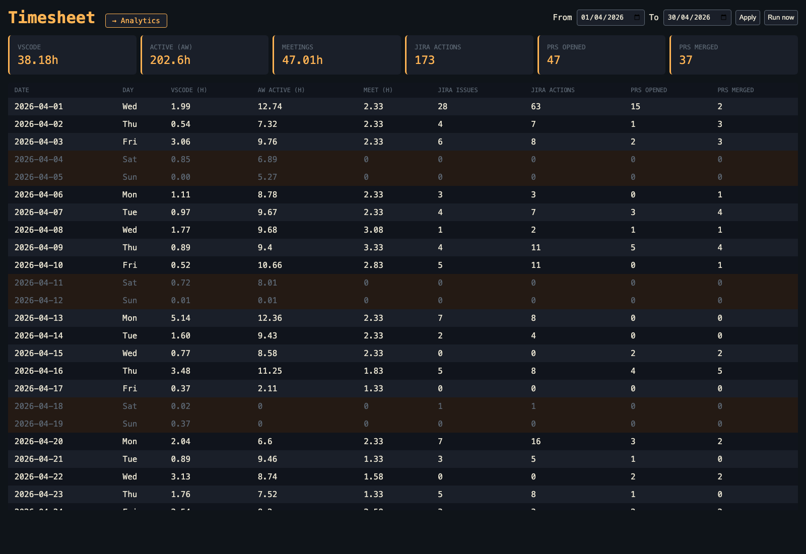
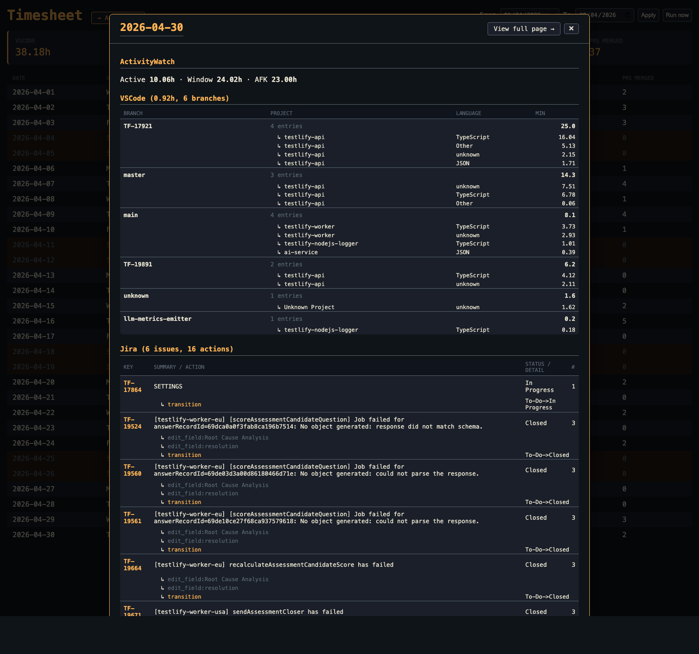
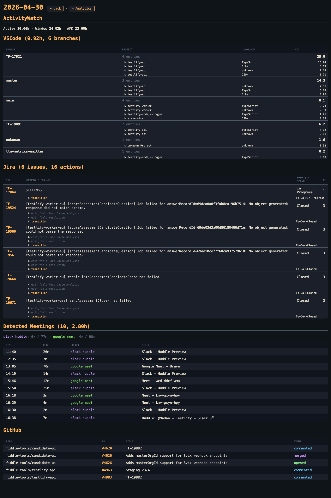
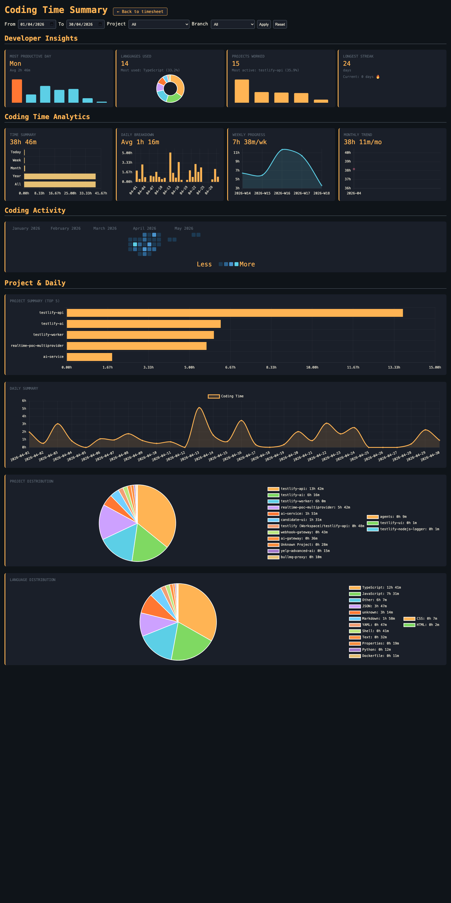

# Timesheet

Self-hosted developer activity dashboard. Pulls signals from your dev workflow into a single SQLite store and visualizes them.

Designed to run on a Raspberry Pi for nightly aggregation, with a sync agent on your Mac/Linux laptop.




## Sources

| Source | What it captures | Where |
|---|---|---|
| **Jira** | Comments, worklogs, status transitions, description edits, field edits — by you only | Cloud REST API |
| **GitHub** | PRs you authored, PRs you commented on | Cloud REST API |
| **Google Calendar** | Scheduled meetings, accepted/declined, Meet links | Secret ICS URL |
| **VS Code Coding Time Tracker** | Minutes per project / branch / language / day | Local sqlite (pushed) |
| **ActivityWatch** | Active vs AFK seconds, window app usage | Local sqlite (pushed) |
| **Detected meetings** | Slack huddles, ad-hoc Google Meet / Zoom / Teams / FaceTime | Derived from ActivityWatch window + browser tab events |

## Features

- **Day modal & full-page detail** with tree-pivoted Jira (by issue) and VSCode (by branch)
- **Analytics page** with Chart.js: most-productive weekday, language donut, top projects, time summary, weekly/monthly trends, GitHub-style activity heatmap
- **ntfy push notifications** on every collector run + every laptop sync
- **systemd timer** on the server, **launchd** on the laptop — fully unattended
- **Optional `pmset` wake schedule** to keep nightly sync working with lid closed

## Screenshots

### Day modal (click a row)
Tree-pivoted Jira (by issue) and VSCode (by branch). Detected meetings (Slack huddles, ad-hoc Meet) inline with scheduled calendar. Deep-linkable via `?openDay=YYYY-MM-DD`.



### Day detail page
Same data as the modal, but a permanent URL (`/day/YYYY-MM-DD`).



### Analytics
Most-productive weekday, language donut, top projects, time summary, weekly/monthly trends, GitHub-style activity heatmap, project + language distribution.



## Architecture

```
                                    ┌──────────────────────┐
                                    │  Raspberry Pi        │
 Laptop                             │                      │
 ┌──────────────────┐  rsync (SSH)  │  /opt/timesheet      │
 │ VSCode tracker   ├──────────────▶│   ├─ collectors/     │
 │ ActivityWatch DB │               │   ├─ data/*.db       │
 └──────────────────┘               │   └─ FastAPI :8080   │
                                    │      ▲               │
 ┌──────────────────┐               │      │ daily 23:55   │
 │ Jira / GitHub /  │ HTTPS         │      │ systemd timer │
 │ Google Calendar  │──────────────▶│ ─────┘               │
 └──────────────────┘               │                      │
                                    │  ntfy ─▶ phone       │
                                    └──────────────────────┘
```

## Quick start

### 1. On the server (Raspberry Pi or any Linux box)

```bash
git clone https://github.com/<you>/timesheet.git /opt/timesheet
cd /opt/timesheet
python3 -m venv .venv
.venv/bin/pip install -r requirements.txt
cp .env.example .env
# edit .env with your tokens
.venv/bin/python db.py
```

Run on demand:
```bash
.venv/bin/python -m collectors.run_all 2026-04-01 2026-04-30   # backfill
.venv/bin/uvicorn app:app --host 0.0.0.0 --port 8080
```

Install as services:
```bash
sudo cp systemd/*.service systemd/*.timer /etc/systemd/system/
sudo systemctl daemon-reload
sudo systemctl enable --now timesheet-collect.timer timesheet-web.service
```

### 2. On the laptop (sync agent)

```bash
# one-time
ssh-copy-id user@server
git clone https://github.com/<you>/timesheet.git ~/timesheet

# manual push
RPI=user@server ~/timesheet/scripts/push_local_data.sh
```

Schedule on macOS (`~/Library/LaunchAgents/com.<you>.timesheet-push.plist`) — see `scripts/push_local_data.sh` for the file the launchd job should run.

To keep nightly sync working with lid closed:
```bash
sudo pmset repeat wakeorpoweron MTWRFSU 23:45:00
```

## Credentials

| Env var | Where to get it |
|---|---|
| `JIRA_API_TOKEN` | https://id.atlassian.com/manage-profile/security/api-tokens |
| `JIRA_ACCOUNT_ID` | call `GET /rest/api/3/myself` once with the token, copy `accountId` |
| `GITHUB_TOKEN` | https://github.com/settings/tokens — scope `repo`, `read:user` |
| `GCAL_ICS_URL` | Google Calendar → Settings → your calendar → "Integrate calendar" → "Secret address in iCal format" |
| `NTFY_URL` / `NTFY_TOPIC` | self-hosted ntfy server, or https://ntfy.sh |

## Schema

SQLite tables: `days`, `vscode_entries`, `activitywatch_daily`, `jira_activity`, `github_events`, `calendar_events`, `meeting_sessions`, `daily_summary`, `run_log`.

See [`db.py`](db.py) for the full schema.

## Status

This is a personal tool. It works for the maintainer's setup. PRs welcome but no support guaranteed.

## License

MIT
